# Hi 👋 I am Boris!

#### 📫 Social media:

---

-   🎓 Bachelor of Science in Electrical Engineering
-   🎯 Full-stack developer (TS & C#)
-   🌱 I’m currently learning Docker & Kubernetes
-   🦀 Planning to learn Rust in future

## Stuff I use

&nbsp;
&nbsp;
&nbsp;
&nbsp;
&nbsp;
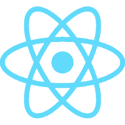&nbsp;
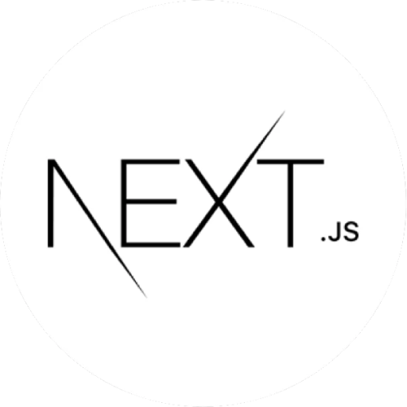&nbsp;
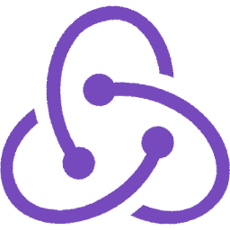&nbsp;
&nbsp;
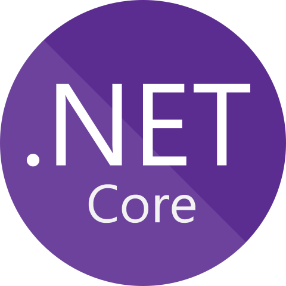&nbsp;
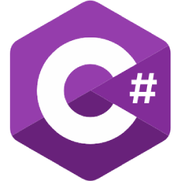&nbsp;
&nbsp;
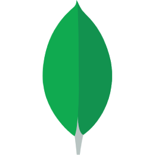&nbsp;
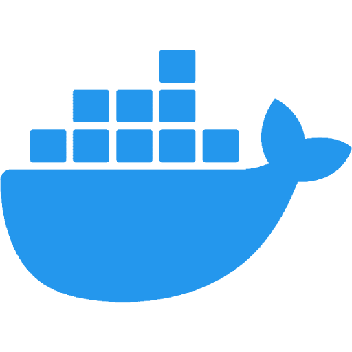&nbsp;
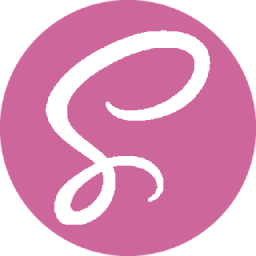&nbsp;
&nbsp;
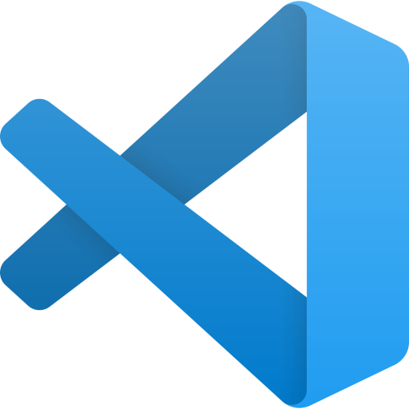&nbsp;

## Stuff I plan to learn

&nbsp;
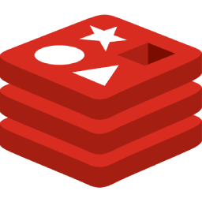&nbsp;
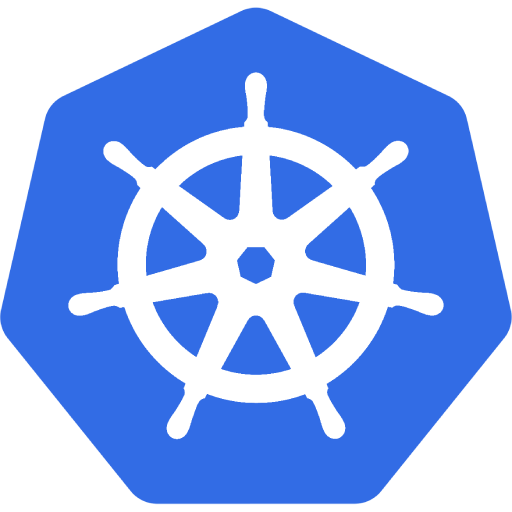&nbsp;
&nbsp;

 

<!--
**borisboskovic/borisboskovic** is a ✨ _special_ ✨ repository because its `README.md` (this file) appears on your GitHub profile.

Here are some ideas to get you started:

- 🔭 I’m currently working on ...
- 🌱 I’m currently learning ...
- 👯 I’m looking to collaborate on ...
- 🤔 I’m looking for help with ...
- 💬 Ask me about ...
- 📫 How to reach me: ...
- 😄 Pronouns: ...
- ⚡ Fun fact: ...

### Top Languages
 

### Github Streaks

-->
