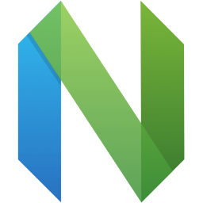
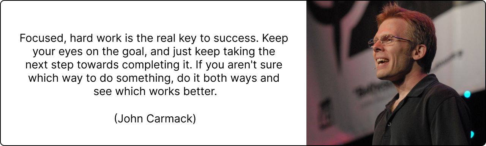

# 
Hello! 👋

#### 📫 Social media:

---

-   🎓 Bachelor of Science in Electrical Engineering
-   🎯 Full-stack developer (TS & C#)

<!--
**borisboskovic/borisboskovic** is a ✨ _special_ ✨ repository because its `README.md` (this file) appears on your GitHub profile.

Here are some ideas to get you started:

- 🔭 I’m currently working on ...
- 🌱 I’m currently learning ...
- 👯 I’m looking to collaborate on ...
- 🤔 I’m looking for help with ...
- 💬 Ask me about ...
- 📫 How to reach me: ...
- 😄 Pronouns: ...
- ⚡ Fun fact: ...

### Top Languages
 

### Github Streaks

### Visitor Count

-->

## Stack

<table>
	<tr>
		<td>
			<strong>Primary<strong>
		</td>
		<td>
			
			
			
			
			
			
			
		</td>
	</tr>
	<tr>
		<td>
			<strong>Secondary</strong>
		</td>
		<td>
			
			
			
			
			
			
			
			
		</td>
	</tr>
	<tr>
		<td>
			<strong>Playing With</strong>
		</td>
		<td>
			
			
			
			
			
			
    		
    	</td>
    </tr>
	<tr>
		<td>
			<strong>Curious about</strong>
		</td>
		<td>
			
			
			
			
			
		</td>
	</tr>
</table>

---

|  |  |
| ------------------------------------------------------------------------------------------------------------------------------ | -------------------------------------------------------------------------------------------- |

